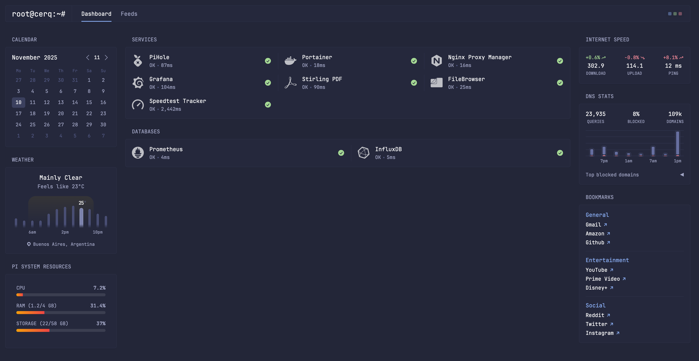

# 🏠 Homelab DietPi - Docker Services

Centralized Docker services setup for DietPi on Raspberry Pi.



---

## 📁 Service Structure

```
homelab-dietpi/
├── .env
├── .env.example
├── .gitignore
├── README.md
├── dashboard.png
├── filebrowser/
│   └── docker-compose.yml
├── glance/
│   ├── docker-compose.yml
│   ├── glance.yml
│   ├── tabs/
│   │   ├── dashboard.yml
│   │   └── feeds.yml
│   └── widgets/
│       ├── bookmarks.yml
│       ├── calendar.yml
│       ├── clock.yml
│       ├── db-monitor.yml
│       ├── hacker-news.yml
│       ├── internet-speed.yml
│       ├── markets.yml
│       ├── news.yml
│       ├── pi-monitor.yml
│       ├── pihole.yml
│       ├── releases.yml
│       ├── rss-homelab.yml
│       └── services-monitor.yml
├── kaneo/
│   └── docker-compose.yml
├── monitoring/
│   ├── compose.yaml
│   ├── grafana/
│   ├── influxdb2/
│   ├── prometheus/
│   └── telegraf/
├── nginx-proxy-manager/
│   └── docker-compose.yml
├── pihole/
│   └── docker-compose.yml
├── portainer/
│   └── docker-compose.yml
├── speedtest/
│   └── docker-compose.yml
└── stirling-pdf/
    └── docker-compose.yml
```

---

## 📋 Services Overview

### 🎨 Glance Dashboard

-   **Port:** 8080
-   **URL:** http://192.168.88.250:8080
-   **Purpose:** Unified dashboard for all homelab services
-   **Features:** Service monitoring, system stats, world clock, weather, news feeds, bookmarks
-   **Network:** raspberry-net

---

### 🛡️ Pi-hole (DNS & Ad Blocking)

-   **Ports:** 53 (DNS), 8053 (Web UI)
-   **URL:** http://192.168.88.250:8053/admin
-   **Credentials:** See `PIHOLE_PASSWORD` in `.env`
-   **Network:** raspberry-net

---

### 🌐 Nginx Proxy Manager

-   **Ports:** 80, 443, 81 (Admin)
-   **Admin URL:** http://192.168.88.250:81
-   **Default credentials:** admin@example.com / changeme
-   **Network:** raspberry-net

---

### 🐳 Portainer

-   **Port:** 9000
-   **URL:** http://192.168.88.250:9000
-   **Purpose:** Docker container management UI
-   **Network:** raspberry-net

---

### 📊 Monitoring Stack

-   **Grafana:** http://192.168.88.250:3000
-   **Prometheus:** http://192.168.88.250:9090
-   **InfluxDB:** http://192.168.88.250:8086
-   **Network:** raspberry-net

---

### 📄 Stirling PDF

-   **Port:** 8082
-   **URL:** http://192.168.88.250:8082
-   **Network:** raspberry-net

---

### 📁 FileBrowser

-   **Port:** 8083
-   **URL:** http://192.168.88.250:8083
-   **Network:** raspberry-net

---

### ⚡ Speedtest Tracker

-   **Port:** 8094
-   **URL:** http://192.168.88.250:8094
-   **API Key:** Set in `.env` after first setup
-   **Network:** raspberry-net

---

### 🎨 Kaneo

-   **Port:** 9999
-   **URL:** http://192.168.88.250:9999
-   **Network:** raspberry-net

---

## 📊 Service Access Summary

| Service             | URL                        | Port |
| ------------------- | -------------------------- | ---- |
| Glance              | http://192.168.88.250:8080 | 8080 |
| Pi-hole             | http://192.168.88.250:8053 | 8053 |
| Nginx Proxy Manager | http://192.168.88.250:81   | 81   |
| Portainer           | http://192.168.88.250:9000 | 9000 |
| Grafana             | http://192.168.88.250:3000 | 3000 |
| Stirling PDF        | http://192.168.88.250:8082 | 8082 |
| FileBrowser         | http://192.168.88.250:8083 | 8083 |
| Speedtest           | http://192.168.88.250:8094 | 8094 |
| Kaneo               | http://192.168.88.250:9999 | 9999 |

---

## 🚀 Quick Start

### Start All Services at Once

```bash
# Using docker compose (v2)
docker compose -f glance/docker-compose.yml \
               -f pihole/docker-compose.yml \
               -f nginx-proxy-manager/docker-compose.yml \
               -f portainer/docker-compose.yml \
               -f monitoring/compose.yaml \
               -f filebrowser/docker-compose.yml \
               -f speedtest/docker-compose.yml \
               -f stirling-pdf/docker-compose.yml \
               -f kaneo/docker-compose.yml \
               up -d
```

---

## 🚀 Coming Soon

-   **NAS (Network Attached Storage)** - File storage and sharing solution (Immich)
-   **Servarr Stack** - Media automation suite (Sonarr, Radarr, Prowlarr, etc.)
-   **Home Assistant** - Smart home automation
-   **Vaultwarden** - Self-hosted password manager
-   And more...
